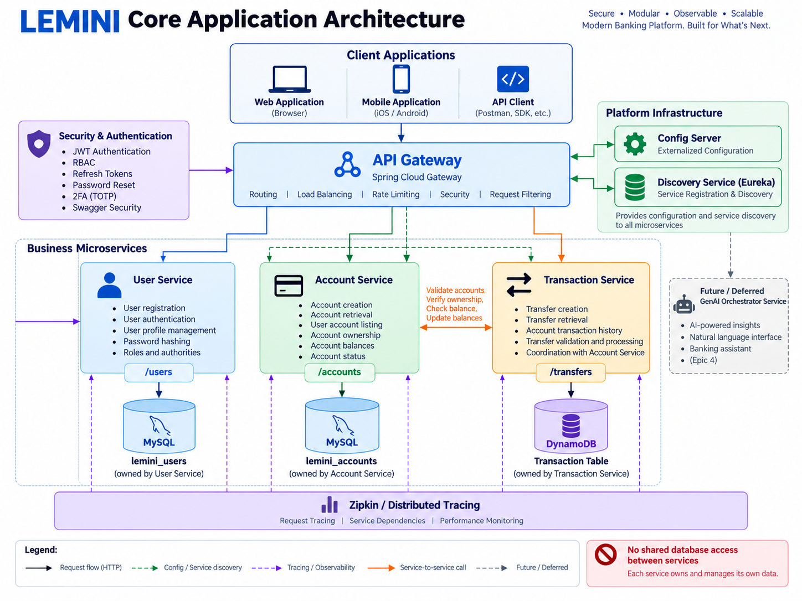

# System Design: LEMINI Platform

## Architecture Overview

LEMINI is designed as a microservices platform built with Java, Spring Boot, and Spring Cloud.

The platform uses synchronous REST communication for client requests and service-to-service operations. Services are independently responsible for their business capabilities and persistence.

The codebase is maintained as a Git monorepo using Maven multi-module management for shared dependency and build configuration.

The current platform architecture includes infrastructure services for configuration, service discovery, API routing, security, and distributed tracing.

Future milestones extend the platform with container orchestration, cloud deployment, event-driven communication, and GenAI capabilities.

### Core Application Architecture

The following diagram shows the main LEMINI microservices, infrastructure components, service-to-service communication, persistence ownership, and distributed tracing.

<p align="center">
  
</p>

---

## Core Services

### API Gateway

The Spring Cloud Gateway provides the external entry point to the LEMINI services.

Responsibilities include:

- Routing requests to the appropriate service.
- Integrating with service discovery.
- Providing a common entry point for platform APIs.
- Supporting security and cross-cutting concerns where applicable.

### Config Server

The Spring Cloud Config Server provides centralized external configuration for platform services.

Services retrieve their environment-specific configuration through the Config Server rather than maintaining duplicated configuration.

### Discovery Service

The Eureka Discovery Service provides service registration and discovery.

Application services register themselves with Eureka and can locate other registered services without relying on hardcoded host addresses.

### User Service

`lemini-user-service` manages user identity and profile information.

Responsibilities include:

- User registration.
- User authentication.
- User profile management.
- Password hashing.
- Roles and authorities.
- Authentication and security functionality defined by Epic 3.

The User Service owns its user persistence.

### Account Service

`lemini-account-service` manages accounts and account state.

Responsibilities include:

- Account creation.
- Account retrieval.
- User account listing.
- Account ownership.
- Account balances and account status.

The Account Service owns its account persistence.

### Transaction Service

`lemini-transaction-service` manages transfers and transaction history.

Responsibilities include:

- Transfer creation.
- Transfer retrieval.
- Account transaction history.
- Transfer validation and processing.
- Coordination with Account Service during transfer operations.

The Transaction Service owns its transaction persistence in DynamoDB. Local development uses DynamoDB Local, while the AWS deployment uses Amazon DynamoDB.

---

## Database and Application Initialization

The User Service uses environment-specific database configuration to support local development, automated testing, staging, and production deployment.

### Environment Profiles

| Profile | Database | Purpose |
|---|---|---|
| `demo` | H2 | Zero-setup local demonstration |
| `test` | H2 | Automated testing |
| `dev` | MySQL | Local development |
| `stage` | MySQL | Staging environment |
| `prod` | MySQL | Production environment |

The `demo` profile allows the User Service to run without requiring a local MySQL installation or production secrets.

Sensitive configuration for stage and production environments is provided externally.

### Schema Management

Flyway manages the User Service database schema and database version history.

Responsibilities include:

- Creating and evolving database tables.
- Managing constraints and relationships.
- Initializing required reference data such as roles and authorities.
- Applying database changes through versioned migrations.

Hibernate remains responsible for ORM and entity mapping. Where appropriate, Hibernate validates the Flyway-managed schema rather than creating or modifying the production schema.

### Data Initialization

Database initialization is separated according to the type of data being created.

- **Flyway migrations** manage schema and required reference data.
- **Demo initialization** creates demo-specific users and data when the `demo` profile is active.
- **Administrative bootstrap** creates an initial administrator for stage or production when explicitly enabled.

Production credentials and bootstrap secrets are supplied externally and are not stored in source control.

### Application Startup Lifecycle

The simplified User Service startup lifecycle is:

```text
SpringApplication.run(...)
        │
        ▼
Load configuration and active profile
        │
        ▼
Create DataSource
        │
        ▼
Run Flyway migrations
        │
        ▼
Create Hibernate / EntityManagerFactory
        │
        ▼
Validate entity mappings
        │
        ▼
Create repositories and services
        │
        ▼
Create Spring Security components
        │
        ├── PasswordEncoder
        ├── AuthenticationProvider
        ├── JWT authentication filter
        └── SecurityFilterChain
        │
        ▼
ApplicationContext ready
        │
        ▼
Run startup initializers
        │
        ├── Demo data initialization
        │
        └── Administrative bootstrap
        │
        ▼
Application ready to accept requests
```

The Spring Security `SecurityContext` is populated during request processing after successful authentication and is not part of application startup initialization.