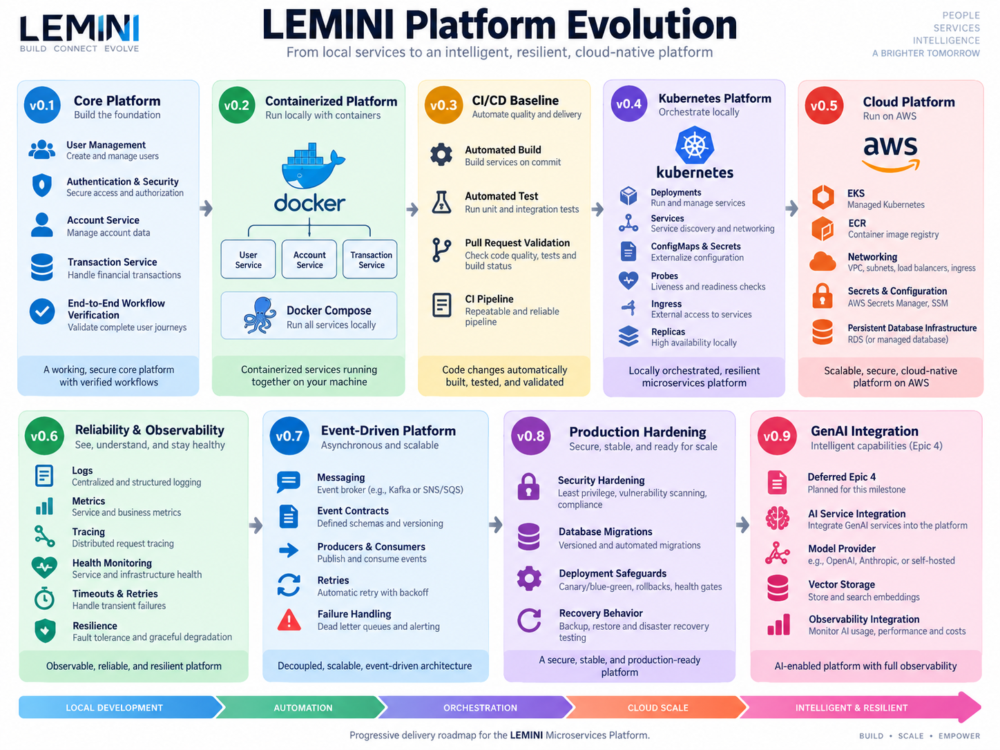

# LEMINI Milestones

This document defines the planned delivery milestones for the LEMINI Microservices Platform.

GitHub Milestones are used to track implementation progress. This document describes the objective and expected scope of each milestone.

## Platform Evolution

  

---

## LEMINI Core Platform v0.1

**Objective:** Complete the core application capabilities required for authenticated users, account management, and transaction processing.

**Scope:**
- Epic 2 audit and completion
- Epic 3: Authentication & Security
- Epic 5: Account & Transaction Services
- End-to-end verification of the core service workflow

---

## LEMINI Containerized Platform v0.2

**Objective:** Run the complete LEMINI platform locally in a reproducible containerized environment.

**Scope:**
- Create Docker images for application services.
- Define Docker Compose configuration for the platform.
- Configure container networking and service dependencies.
- Configure runtime application settings.
- Run databases and required infrastructure dependencies in containers.
- Verify the complete local containerized environment.

---

## LEMINI CI/CD Baseline v0.3

**Objective:** Automate repository validation and establish consistent build and test checks for application changes.

**Scope:**
- Automate Maven build and verification.
- Run automated tests in CI.
- Validate pull requests.
- Validate changes merged to the main branch.
- Report build and test failures.
- Establish initial quality gates.

---

## LEMINI Kubernetes Platform v0.4

**Objective:** Run the containerized LEMINI platform on a local Kubernetes cluster.

**Scope:**
- Deploy LEMINI services to local Kubernetes.
- Define Kubernetes Deployments and Services.
- Manage application configuration with ConfigMaps.
- Manage sensitive runtime configuration with Secrets.
- Configure liveness and readiness probes.
- Configure ingress for external access where required.
- Define replica configuration for applicable services.
- Verify service discovery and inter-service communication in Kubernetes.
- Document local Kubernetes setup and operation.

---

## LEMINI Cloud Platform v0.5

**Objective:** Deploy the Kubernetes-based LEMINI platform to AWS.

**Scope:**
- Provision an Amazon EKS environment.
- Publish container images to Amazon ECR.
- Deploy LEMINI workloads to EKS.
- Configure AWS networking for the platform.
- Configure persistent database infrastructure.
- Manage application configuration and secrets.
- Configure external access to platform services.
- Document and verify the AWS deployment process.

---

## LEMINI Reliability & Observability v0.6

**Objective:** Improve operational visibility and resilience across distributed services.

**Scope:**
- Centralize application logging.
- Collect application and platform metrics.
- Verify distributed tracing across service boundaries.
- Improve health monitoring.
- Configure appropriate timeouts and retries.
- Introduce resilience patterns where appropriate.
- Document operational diagnostics and observability workflows.

---

## LEMINI Event-Driven Platform v0.7

**Objective:** Add asynchronous communication for workflows that benefit from event-driven processing.

**Scope:**
- Add messaging infrastructure.
- Define event contracts.
- Implement event producers and consumers.
- Implement retry and failure-handling strategies.
- Handle failed messages reliably.
- Verify event-driven workflows through integration testing.
- Document messaging flows and service responsibilities.

---

## LEMINI Production Hardening v0.8

**Objective:** Strengthen application security, configuration, deployment, persistence, and operational behavior for production-like environments.

**Scope:**
- Review and harden security configuration.
- Harden runtime configuration and secret handling.
- Establish controlled database migration practices.
- Add deployment safeguards.
- Review failure and recovery behavior.
- Verify operational readiness of platform components.
- Update production-oriented operational documentation.

---

## LEMINI GenAI Integration v0.9

**Objective:** Resume the deferred GenAI Orchestrator work and integrate AI functionality with the stabilized platform.

**Scope:**
- Resume Epic 4: GenAI Orchestrator Service.
- Integrate AI service capabilities with the platform.
- Configure model-provider integration.
- Integrate vector storage where required.
- Apply platform authentication and authorization requirements.
- Integrate AI workflows with existing observability.
- Deploy and verify GenAI components within the established platform architecture.